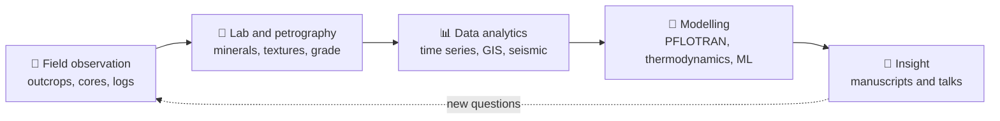
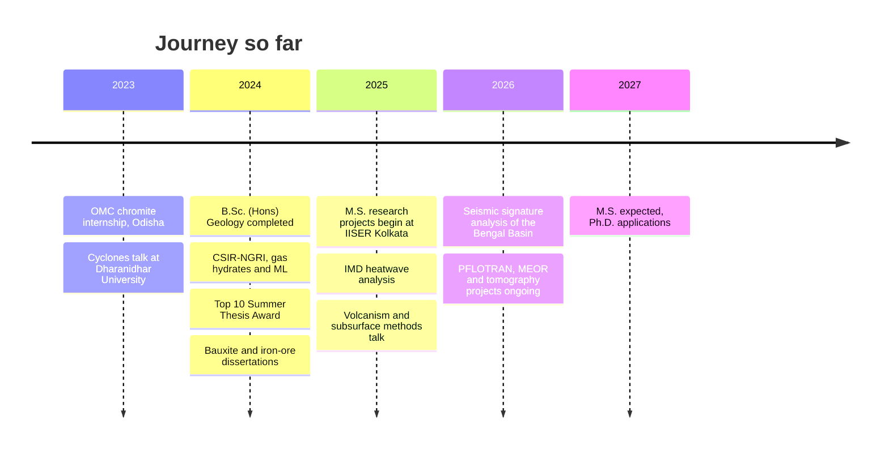

<div align="center">


### Geoscience Researcher | Geophysics & Critical Minerals | AI/ML for Earth Science
*From outcrop to algorithm: field geology, geochemistry, geophysics and machine learning*

[](mailto:jeevanjyotirout25@gmail.com)
[](https://linkedin.com/in/jeevan-jyoti-rout-jjr)
[](https://github.com/Jeevanjyotirout)
[](https://www.iiserkol.ac.in/)


</div>

---

## 👋 About me

I am an M.S. researcher in Geological Sciences at **IISER Kolkata** (expected June 2027), building on a B.Sc. (Honours) in Geology with minors in Physics and Mathematics. I am a passionate and enthusiastic geoscientist who enjoys working across domains: my work combines **field-based geological interpretation** with **seismic methods, well-log analysis, reactive-transport simulation and machine learning**, with a long-term interest in critical-mineral exploration and resource characterisation.

My current research applies **seismic tomography and receiver-function analysis** to image subsurface volcanic structures, building on earlier work in ML-based lithology prediction and gas-hydrate exploration at **CSIR-NGRI**. I am interested in quantitative, reproducible methods for subsurface characterisation and exploration decision-making under geological uncertainty, and I am applying for **Ph.D. positions in the Earth sciences and allied fields for 2027**.

> 🌍 *Scroll down for an interactive map of every field site, internship and research base in this profile.*

## ⚡ At a glance

| | |
|---|---|
| 🎓 **Education** | M.S. Geological Sciences, IISER Kolkata (exp. Jun 2027, CGPA 7.3/10) · B.Sc. (Hons) Geology with Physics and Mathematics minors, Dharanidhar University (2024, CGPA 8.2/10) |
| 🔬 **Core methods** | PFLOTRAN reactive transport · Gibbs free-energy analysis · seismic tomography · CNNs/PyTorch · GIS and remote sensing · time-series analytics |
| 💻 **Languages** | Python · MATLAB · FORTRAN · SQL · JavaScript · HTML/CSS |
| 🧭 **Fieldwork** | 10 field courses and mine sites across Odisha, Andhra Pradesh and the Himalayan foreland |
| 📄 **Manuscript** | *Steam-mediated breakdown of complex hydrocarbons and crude oil for hydrogen generation with CO₂ sequestration* (in preparation) |
| 🏆 **Recognition** | Top 10 Summer Thesis Award, CSIR-NGRI (national level, ~5,000 participants) · Qualified IIT JAM 2024, CUET-PG, NET and GATE |
| 🎤 **Talks** | 5 presentations · 6 conferences and scientific meetings |

---

## 🗺️ Interactive Earth map: where the work happened

Click any marker for details. Colours: 🟢 field trips · 🔴 mining and ore geology · 🟠 internships · 🔵 institutions.

```geojson
{
 "type": "FeatureCollection",
 "features": [
  {
   "type": "Feature",
   "geometry": {
    "type": "Point",
    "coordinates": [
     88.525,
     22.9647
    ]
   },
   "properties": {
    "title": "IISER Kolkata (M.S. Geological Sciences)",
    "description": "Home institute. PFLOTRAN reactive-transport and MEOR digital-twin modelling, seismic tomography of volcanic systems, hydrogen-with-CO2-sequestration manuscript, astronomical and AQI data analysis.",
    "marker-color": "#0969da",
    "marker-symbol": "college",
    "marker-size": "medium"
   }
  },
  {
   "type": "Feature",
   "geometry": {
    "type": "Point",
    "coordinates": [
     77.93,
     30.19
    ]
   },
   "properties": {
    "title": "Mohand Foreland Basin, Dehradun",
    "description": "PG field course: fluvial terraces, bars and floodplain deposits; paleoflow, grain-size and clast analysis, strike-dip measurements, Himalayan foreland-basin evolution. (approximate site marker)",
    "marker-color": "#2ea44f",
    "marker-symbol": "mountain",
    "marker-size": "medium"
   }
  },
  {
   "type": "Feature",
   "geometry": {
    "type": "Point",
    "coordinates": [
     78.5455,
     17.4126
    ]
   },
   "properties": {
    "title": "CSIR-NGRI, Hyderabad",
    "description": "Gas-hydrate exploration and ML lithology prediction from NGHP well-logs (CNNs, PyTorch). May-Jul 2024. Top 10 Summer Thesis Award. (approximate site marker)",
    "marker-color": "#d29922",
    "marker-symbol": "star",
    "marker-size": "medium"
   }
  },
  {
   "type": "Feature",
   "geometry": {
    "type": "Point",
    "coordinates": [
     77.22,
     28.59
    ]
   },
   "properties": {
    "title": "India Meteorological Department, New Delhi",
    "description": "Heatwave and cloudburst time-series analysis with predictive assessment. May-Jun 2025. (approximate site marker)",
    "marker-color": "#d29922",
    "marker-symbol": "star",
    "marker-size": "medium"
   }
  },
  {
   "type": "Feature",
   "geometry": {
    "type": "Point",
    "coordinates": [
     85.83,
     21.03
    ]
   },
   "properties": {
    "title": "Nuasahi-Boula Chromite Mine (OMC)",
    "description": "Summer 2023: core logging, Cr2O3 grade and structural analysis, AutoCAD wireframe modelling, exploration-grid planning, ESG exposure. (approximate site marker)",
    "marker-color": "#cf222e",
    "marker-symbol": "industry",
    "marker-size": "medium"
   }
  },
  {
   "type": "Feature",
   "geometry": {
    "type": "Point",
    "coordinates": [
     82.92,
     18.72
    ]
   },
   "properties": {
    "title": "Panchpatmali Bauxite Deposit, Damanjodi (NALCO)",
    "description": "B.Sc. dissertation: geology and economics of Asia's largest bauxite deposit. (approximate site marker)",
    "marker-color": "#cf222e",
    "marker-symbol": "industry",
    "marker-size": "medium"
   }
  },
  {
   "type": "Feature",
   "geometry": {
    "type": "Point",
    "coordinates": [
     85.05,
     21.83
    ]
   },
   "properties": {
    "title": "KJST Iron and Bauxite Mines, Koira",
    "description": "B.Sc. dissertation: geological setting, lithology, mineralization and ore-grade assessment. (approximate site marker)",
    "marker-color": "#cf222e",
    "marker-symbol": "industry",
    "marker-size": "medium"
   }
  },
  {
   "type": "Feature",
   "geometry": {
    "type": "Point",
    "coordinates": [
     85.5817,
     21.6289
    ]
   },
   "properties": {
    "title": "Dharanidhar University, Keonjhar",
    "description": "B.Sc. (Hons) Geology; Minors in Physics and Mathematics. Base for undergraduate field courses. (approximate site marker)",
    "marker-color": "#0969da",
    "marker-symbol": "college",
    "marker-size": "medium"
   }
  },
  {
   "type": "Feature",
   "geometry": {
    "type": "Point",
    "coordinates": [
     85.79,
     21.5
    ]
   },
   "properties": {
    "title": "Sitabinji (Sita Kunj), Keonjhar",
    "description": "Precambrian rock formations, boulder structures, rock shelters and inscriptions; field mapping and reporting. (approximate site marker)",
    "marker-color": "#2ea44f",
    "marker-symbol": "mountain",
    "marker-size": "medium"
   }
  },
  {
   "type": "Feature",
   "geometry": {
    "type": "Point",
    "coordinates": [
     85.42,
     21.72
    ]
   },
   "properties": {
    "title": "Dhanabeni, Keonjhar",
    "description": "Dhanabeni granitoid plutons of the Bonai-Keonjhar batholithic belt; phaneritic textures and modal mineralogy to infer cooling history. (approximate site marker)",
    "marker-color": "#2ea44f",
    "marker-symbol": "mountain",
    "marker-size": "medium"
   }
  },
  {
   "type": "Feature",
   "geometry": {
    "type": "Point",
    "coordinates": [
     85.3,
     21.55
    ]
   },
   "properties": {
    "title": "Nomira, Keonjhar",
    "description": "~2.8 Ga pillow-lava formations at a geo-heritage site; outcrop mapping for crustal-evolution studies. (approximate site marker)",
    "marker-color": "#2ea44f",
    "marker-symbol": "mountain",
    "marker-size": "medium"
   }
  },
  {
   "type": "Feature",
   "geometry": {
    "type": "Point",
    "coordinates": [
     85.9667,
     21.5833
    ]
   },
   "properties": {
    "title": "Bhimkund",
    "description": "Gorge and plunge-pool fluvial-erosion features and Precambrian mafic dyke swarms; geotectonic implications.",
    "marker-color": "#2ea44f",
    "marker-symbol": "mountain",
    "marker-size": "medium"
   }
  },
  {
   "type": "Feature",
   "geometry": {
    "type": "Point",
    "coordinates": [
     85.7,
     21.45
    ]
   },
   "properties": {
    "title": "Suleipat Dam, Odisha",
    "description": "Engineering-geological assessment of a dam foundation on granite-dolerite intrusions; discontinuity and bank-stability evaluation. (approximate site marker)",
    "marker-color": "#2ea44f",
    "marker-symbol": "mountain",
    "marker-size": "medium"
   }
  },
  {
   "type": "Feature",
   "geometry": {
    "type": "Point",
    "coordinates": [
     85.65,
     21.7
    ]
   },
   "properties": {
    "title": "Gundichaghagi Waterfall, Kendujhar",
    "description": "Waterfall on Banded Iron Formation and Banded Hematite Quartzite; differential erosion and geomorphic controls. (approximate site marker)",
    "marker-color": "#2ea44f",
    "marker-symbol": "mountain",
    "marker-size": "medium"
   }
  },
  {
   "type": "Feature",
   "geometry": {
    "type": "Point",
    "coordinates": [
     85.6,
     21.66
    ]
   },
   "properties": {
    "title": "Handibhaga Waterfall, Odisha",
    "description": "Fluvial erosion, channel dynamics and sedimentary structures (ripple marks, bedding). (approximate site marker)",
    "marker-color": "#2ea44f",
    "marker-symbol": "mountain",
    "marker-size": "medium"
   }
  },
  {
   "type": "Feature",
   "geometry": {
    "type": "Point",
    "coordinates": [
     85.1172,
     21.7613
    ]
   },
   "properties": {
    "title": "Khandadhar Waterfall",
    "description": "~244 m waterfall on the Korapani stream; BIF/BHQ-controlled cliff-face resistance and plunge-pool formation.",
    "marker-color": "#2ea44f",
    "marker-symbol": "mountain",
    "marker-size": "medium"
   }
  },
  {
   "type": "Feature",
   "geometry": {
    "type": "Point",
    "coordinates": [
     83.0364,
     18.2807
    ]
   },
   "properties": {
    "title": "Borra Caves, Andhra Pradesh",
    "description": "Limestone karst: cave topography, groundwater-carbonate interaction and speleothem formation.",
    "marker-color": "#2ea44f",
    "marker-symbol": "mountain",
    "marker-size": "medium"
   }
  }
 ]
}
```

> **Note on accuracy:** markers for Bhimkund, Khandadhar, Borra Caves and IISER Kolkata use published coordinates. The remaining markers are approximate site positions (district or town level) and mark the general area of each visit.

<details>
<summary><b>📍 Field atlas: every site with coordinates (click to expand)</b></summary>

<br>

| Type | Site | What I did there | Location |
|---|---|---|---|
| Institution | **IISER Kolkata (M.S. Geological Sciences)** | Home institute. PFLOTRAN reactive-transport and MEOR digital-twin modelling, seismic tomography of volcanic systems, hydrogen-with-CO2-sequestration manuscript, astronomical and AQI data analysis. | [22.965, 88.525](https://www.openstreetmap.org/?mlat=22.9647&mlon=88.525#map=11/22.9647/88.525) |
| Field trip | **Mohand Foreland Basin, Dehradun** | PG field course: fluvial terraces, bars and floodplain deposits; paleoflow, grain-size and clast analysis, strike-dip measurements, Himalayan foreland-basin evolution. | [30.190, 77.930](https://www.openstreetmap.org/?mlat=30.19&mlon=77.93#map=11/30.19/77.93) |
| Internship | **CSIR-NGRI, Hyderabad** | Gas-hydrate exploration and ML lithology prediction from NGHP well-logs (CNNs, PyTorch). May-Jul 2024. Top 10 Summer Thesis Award. | [17.413, 78.546](https://www.openstreetmap.org/?mlat=17.4126&mlon=78.5455#map=11/17.4126/78.5455) |
| Internship | **India Meteorological Department, New Delhi** | Heatwave and cloudburst time-series analysis with predictive assessment. May-Jun 2025. | [28.590, 77.220](https://www.openstreetmap.org/?mlat=28.59&mlon=77.22#map=11/28.59/77.22) |
| Mining / ore geology | **Nuasahi-Boula Chromite Mine (OMC)** | Summer 2023: core logging, Cr2O3 grade and structural analysis, AutoCAD wireframe modelling, exploration-grid planning, ESG exposure. | [21.030, 85.830](https://www.openstreetmap.org/?mlat=21.03&mlon=85.83#map=11/21.03/85.83) |
| Mining / ore geology | **Panchpatmali Bauxite Deposit, Damanjodi (NALCO)** | B.Sc. dissertation: geology and economics of Asia's largest bauxite deposit. | [18.720, 82.920](https://www.openstreetmap.org/?mlat=18.72&mlon=82.92#map=11/18.72/82.92) |
| Mining / ore geology | **KJST Iron and Bauxite Mines, Koira** | B.Sc. dissertation: geological setting, lithology, mineralization and ore-grade assessment. | [21.830, 85.050](https://www.openstreetmap.org/?mlat=21.83&mlon=85.05#map=11/21.83/85.05) |
| Institution | **Dharanidhar University, Keonjhar** | B.Sc. (Hons) Geology; Minors in Physics and Mathematics. Base for undergraduate field courses. | [21.629, 85.582](https://www.openstreetmap.org/?mlat=21.6289&mlon=85.5817#map=11/21.6289/85.5817) |
| Field trip | **Sitabinji (Sita Kunj), Keonjhar** | Precambrian rock formations, boulder structures, rock shelters and inscriptions; field mapping and reporting. | [21.500, 85.790](https://www.openstreetmap.org/?mlat=21.5&mlon=85.79#map=11/21.5/85.79) |
| Field trip | **Dhanabeni, Keonjhar** | Dhanabeni granitoid plutons of the Bonai-Keonjhar batholithic belt; phaneritic textures and modal mineralogy to infer cooling history. | [21.720, 85.420](https://www.openstreetmap.org/?mlat=21.72&mlon=85.42#map=11/21.72/85.42) |
| Field trip | **Nomira, Keonjhar** | ~2.8 Ga pillow-lava formations at a geo-heritage site; outcrop mapping for crustal-evolution studies. | [21.550, 85.300](https://www.openstreetmap.org/?mlat=21.55&mlon=85.3#map=11/21.55/85.3) |
| Field trip | **Bhimkund** | Gorge and plunge-pool fluvial-erosion features and Precambrian mafic dyke swarms; geotectonic implications. | [21.583, 85.967](https://www.openstreetmap.org/?mlat=21.5833&mlon=85.9667#map=11/21.5833/85.9667) |
| Field trip | **Suleipat Dam, Odisha** | Engineering-geological assessment of a dam foundation on granite-dolerite intrusions; discontinuity and bank-stability evaluation. | [21.450, 85.700](https://www.openstreetmap.org/?mlat=21.45&mlon=85.7#map=11/21.45/85.7) |
| Field trip | **Gundichaghagi Waterfall, Kendujhar** | Waterfall on Banded Iron Formation and Banded Hematite Quartzite; differential erosion and geomorphic controls. | [21.700, 85.650](https://www.openstreetmap.org/?mlat=21.7&mlon=85.65#map=11/21.7/85.65) |
| Field trip | **Handibhaga Waterfall, Odisha** | Fluvial erosion, channel dynamics and sedimentary structures (ripple marks, bedding). | [21.660, 85.600](https://www.openstreetmap.org/?mlat=21.66&mlon=85.6#map=11/21.66/85.6) |
| Field trip | **Khandadhar Waterfall** | ~244 m waterfall on the Korapani stream; BIF/BHQ-controlled cliff-face resistance and plunge-pool formation. | [21.761, 85.117](https://www.openstreetmap.org/?mlat=21.7613&mlon=85.1172#map=11/21.7613/85.1172) |
| Field trip | **Borra Caves, Andhra Pradesh** | Limestone karst: cave topography, groundwater-carbonate interaction and speleothem formation. | [18.281, 83.036](https://www.openstreetmap.org/?mlat=18.2807&mlon=83.0364#map=11/18.2807/83.0364) |

</details>

---

## 🧪 Research portfolio

<details open>
<summary><b>💧 Reactive-transport simulation with PFLOTRAN</b> · IISER Kolkata · <i>ongoing</i></summary>

- Simulating subsurface reservoir conditions and fluid–rock interaction to understand the geochemical conditions that control mineralisation.
- Runs alongside seismic-tomography work, linking subsurface imaging with modelling of fluid behaviour within the imaged systems.
- The approach is transferable to a wide range of Earth-system and planetary geochemistry problems.

</details>

<details open>
<summary><b>⚗️ Steam-mediated hydrocarbon breakdown for hydrogen generation with CO₂ sequestration</b> · manuscript in preparation</summary>

- Coupled, multi-stage pathway built on full reaction formulation and **Gibbs free-energy analysis**.
- Reaction by reaction: steam injected into a reservoir breaks heavy, high-molecular-weight crude components into lighter hydrocarbons and methane; catalytic reforming converts methane to hydrogen; residual CO₂ is recycled back into the reservoir for additional hydrogen.
- Traced through separation, compression and permanent underground CO₂ sequestration.

</details>

<details>
<summary><b>🦠 Microbial Enhanced Oil Recovery (MEOR) digital twin</b> · IISER Kolkata · <i>ongoing</i></summary>

- Developing a PFLOTRAN-based digital-twin framework for reservoir-scale microbial and geochemical processes.
- Investigating microbial metabolism, biosurfactant/biopolymer production and syntrophic methanogenesis in petroleum-rich Indian sedimentary basins.
- Synthesising thermodynamic and microbiological literature (key species, Gibbs free-energy considerations).

</details>

<details>
<summary><b>🌋 Seismic tomography of volcanic systems and geothermal feasibility</b> · IISER Kolkata · <i>ongoing</i></summary>

- Independent M.S. project covering the full pipeline: teleseismic data retrieval, quality control, deconvolution and stacking of multi-station receiver functions to resolve velocity contrasts relevant to volcanic plumbing systems.
- Imaging shallow-to-mid-crustal architecture beneath active and dormant volcanoes: magma-reservoir geometry, hydrothermal pathways, heat-source distribution.
- Integrating velocity structure with thermal and geological constraints to assess geothermal potential.
- Evaluating reservoir viability and site feasibility for geothermal power plants.

</details>

<details>
<summary><b>🤖 Gas-hydrate exploration and ML lithology prediction</b> · CSIR–NGRI Hyderabad · May–Jul 2024</summary>

- Developed and extended supervised ML workflows for automated lithology prediction from NGHP well-log data.
- Applied CNN architectures with PyTorch and Hugging Face tooling for facies discrimination.
- Benchmarked ML predictions against conventional lithological interpretation; presented at CSIR-NGRI and recognised with the **Top 10 Summer Thesis Award** (national level, ~5,000 participants).
- Also evaluated gas-hydrate potential along the Indian coastal belt under the National Gas Hydrate Project (2024), studying geological and geophysical controls on hydrate occurrence and stability.
- Hands-on with seismic and well-logging acquisition instrumentation.

</details>

<details>
<summary><b>🌡️ Extreme-weather and climate-hazard analytics</b> · IMD New Delhi (2025) · IISER Kolkata</summary>

- Heatwave and cloudburst analysis over the Delhi metropolitan region using large meteorological time series, with predictive assessments, and characterised short-duration, high-intensity rainfall bursts, a skill set transferable to time-series-heavy geophysical signal processing.
- Temporal analysis of Kolkata AQI data (Jan–Dec 2025): PM₂.₅ and PM₁₀ patterns versus heatwave occurrence and climate-hazard trends.

</details>

<details>
<summary><b>🔭 Astronomical and solar data analysis</b> · Python and MATLAB</summary>

- Hubble Space Telescope statistical analysis and curve fitting.
- Solar EUV image analysis and temporal analysis of flare light curves from NASA SDO/AIA.

</details>

<details>
<summary><b>⛏️ Ore geology and exploration</b> · OMC chromite internship (2023) · B.Sc. research (2024)</summary>

- Chromite grade (Cr₂O₃) and structural analysis, core logging, AutoCAD wireframe modelling, drill-hole and exploration-grid planning, ESG exposure at an operating mine.
- KJST iron and bauxite mines (Koira) and Panchpatmali bauxite (NALCO, Damanjodi): mineralization, ore-body characteristics and economic significance.

</details>

<details>
<summary><b>🏔️ Sedimentology and basin analysis</b> · Mohand Foreland Basin, Dehradun</summary>

- Grain-size and clast analysis, facies interpretation, sedimentary structures and strike–dip measurements to reconstruct paleoflow and Himalayan tectono-sedimentary evolution.

</details>

<details>
<summary><b>📚 Other projects</b></summary>

- **Coral-reef decline:** Earth-system literature synthesis on ocean acidification, carbonate production, marine carbon cycling and long-term carbon sequestration.
- **Large-scale information retrieval:** Apache Lucene/PyLucene indexing, BM25 parameter optimisation, evaluation on FIRE 2012 topics with MAP metrics.

</details>

### 🧷 Selected repositories and work

| Area | Project | Stack | Status |
|---|---|---|---|
| Seismology | **Seismic Tomography**: teleseismic data retrieval, receiver-function processing, velocity-structure imaging | Python · SAC · MATLAB | 🟢 Active research |
| Seismology | **Automated Seismology Data Pipeline (IRIS)**: automated retrieval and preprocessing of waveform data from IRIS/FDSN | Python · ObsPy · IRIS/FDSN | 🟢 Active |
| ML geoscience | **[Advanced Lithology Prediction](https://github.com/Jeevanjyotirout/Advance-Lithology-Prediction)**: ML classification of lithology from well-log signatures (CSIR-NGRI) | Python · scikit-learn · Pandas | 🔬 Research |
| Earth resources | **Gas-hydrate exploration**: potential along the Indian coastal belt, geological and geophysical controls on hydrate stability | Seismic · GIS | 🔬 Research |
| Earth science | **[Earth Science Projects](https://github.com/Jeevanjyotirout/Earth-Science-Projects)**: geoscience data-analysis exercises on field-derived and open datasets | Python | 🛠️ In development |
| Remote sensing | **Remote Sensing and GIS / Stream and Catchment Delineation**: terrain, hydrology, watershed and stream-network delineation from DEMs | QGIS · Python | 🧭 Exploratory |
| Planetary science | **Exoplanet and Astrophysics Data Analysis**: statistical analysis of astronomical time series | Python | 🧭 Exploratory |
| Scientific retrieval | **Hybrid RAG for Scientific Information Retrieval**: context-aware retrieval prototype for research data | Python | 🛠️ In development |

> The seismic-imaging project is in active development; no final structural results are claimed at this stage. Smaller automation and web experiments on my profile are omitted as they are not central to my research focus.

### 🔁 How I work



---

## 🧰 Skills and tech stack


| Domain | Details |
|---|---|
| **Computational geoscience** | PFLOTRAN reactive transport, digital-twin reservoir simulation, numerical modelling and scientific computing |
| **Geochemistry** | Gibbs free-energy and reaction thermodynamics, reaction formulation, mineralogical and petrographic characterisation |
| **ML and AI** | Supervised, unsupervised and semi-supervised learning; CNN/GNN with PyTorch and Hugging Face; feature engineering; model evaluation |
| **Geophysics** | SAC, IRIS/FDSN workflows, teleseismic waveform processing, seismic interpretation, signal processing, tomography (developing), receiver functions, well-log interpretation, electrical resistivity |
| **Data analytics** | Statistical, spatial and temporal analysis of well-log, seismic, climate, environmental and astronomical datasets |
| **Economic geology** | Ore identification (hand specimen and thin section), prospectivity, exploration targeting, grade analysis, ESG planning |
| **Structure and sedimentology** | Strike-dip, structural interpretation, paleoflow reconstruction, facies and basin analysis, geological mapping |
| **Geospatial** | QGIS, raster/vector analysis, DEM and terrain analysis, drainage-basin characterisation, satellite interpretation |
| **Software** | Litholog, Stereonet, rose diagrams, AutoCAD (ore-body wireframes), Apache Lucene |
| **Communication** | Scientific writing, LaTeX, manuscript preparation, conference presentation |

---

## 🎯 Research interests

- 🤖 **AI/ML for mineral and geophysical exploration:** mineral prospectivity, automated data pipelines, cutting exploration cost while improving efficiency and accuracy
- 🌍 **Earth-system and planetary science:** early Earth, rocky-planet evolution, habitability, volcanology
- 🚀 **Astrogeology and space resources:** planetary critical-mineral mapping
- ⚗️ **Geochemistry and reaction thermodynamics:** fluid–rock interaction, mineral precipitation/dissolution
- 💎 **Ore deposits:** ore-forming fluids, fluid inclusions, stable isotopes, salt-dome cap-rock evolution
- 💧 **Reactive transport and subsurface processes**
- 📡 **Geophysics and seismic tomography:** receiver functions, teleseismic waveform processing, volcanology, glaciology, basins, hydrocarbons and gas hydrates
- 🛰️ **Remote sensing and GIS:** hydrology, early warning, critical-mineral potential
- ⚡ **Energy, climate and sustainability:** hydrogen with CO₂ sequestration, geothermal, MEOR, climate hazards

---

## 🏆 Achievements

- **Top 10 Summer Thesis Award**, national level (~5,000 participants), CSIR-NGRI
- Qualified **IIT JAM 2024, CUET-PG, NET and GATE**

## 🎓 Education and experience timeline



## 📄 Manuscripts, presentations and meetings

**Manuscript**
- Rout, J. J., and Mishra, A. *Steam-mediated breakdown of complex hydrocarbons and crude oil for hydrogen generation with CO₂ sequestration.* Manuscript in preparation.

**Dissertations (B.Sc., Dharanidhar University, 2024)**
- *The Geological Study of the KJST Iron and Bauxite Mines, Koira, Odisha, India*
- *Bauxite Deposits: A Geological Case Study of the NALCO Mines at Panchpatmali, Damanjodi, Koraput, Odisha, Asia's Largest Bauxite Deposit*

**Presentations**
- Seismic Signature Analysis of the Bengal Basin, IISER Kolkata, 2026
- Understanding Volcanism and Sub-Surface Investigative Methods, IISER Kolkata, 2025
- Advanced Lithology Prediction Using Machine Learning on Well-Log Data, CSIR–NGRI, 2024
- Gas Hydrates: The Fuel of the Future, CSIR–NGRI, 2024
- Cyclones: Formation, Impact Pathways, and Preparedness in Odisha, Dharanidhar University, 2023

**Conferences and scientific meetings**
- GeoHEAT: A Novel Exploration Approach for Geothermal Energy Prospection and Utilisation (CSIR–NGRI)
- India Heat Budget Summit 2025 (India International Centre, New Delhi)
- Critical Minerals and Their Exploration Techniques (Geological Survey of India, Hyderabad)
- Aditya-L1: India's First Dedicated Space-Based Solar Observatory · Neutrino Tomography of Earth · Solar System and Beyond (IISER Kolkata)

---

## 📊 GitHub stats

<div align="center">


</div>

---

## 🧭 Research philosophy

I am interested in building computational methods that make geological and geophysical observations more quantitative, reproducible and useful for scientific decision-making under uncertainty. My computational work stays grounded in direct field and laboratory geology across chromite, iron, manganese and bauxite deposits, and in training in sedimentology, stratigraphy, structural geology, mineralogy and ore geology.

---

## 🤝 Let's connect

I am open to conversations about **Ph.D. opportunities, collaborations and research projects** across the Earth sciences. Email: [jeevanjyotirout25@gmail.com](mailto:jeevanjyotirout25@gmail.com) · LinkedIn: [in/jeevan-jyoti-rout-jjr](https://linkedin.com/in/jeevan-jyoti-rout-jjr) · GitHub: [@Jeevanjyotirout](https://github.com/Jeevanjyotirout)

**Academic references:** Dr. Prashant Kumar Mishra (Dharanidhar University) · Dr. Achyut Mishra (IIT Gandhinagar)

<div align="center">

*"The best geologists are those who have seen the most rocks."* Field first, then model.

</div>
